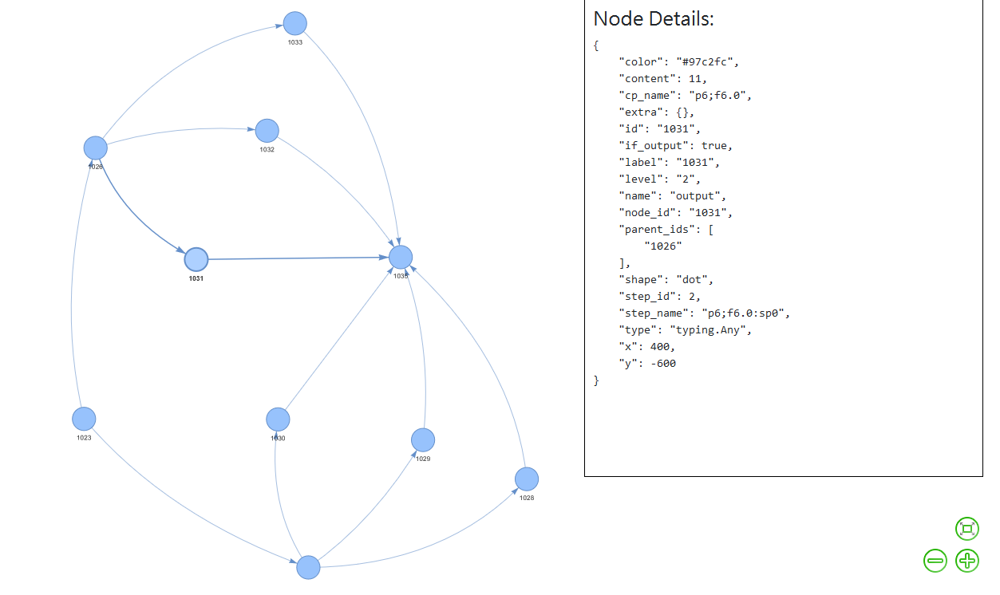

# GPT Graph

GPT Graph is a flexible library designed to address some of the limitations of LangChain, particularly its over-abstraction. While it's still in early development and not yet sophisticated, it aims to offer features for component creation, pipeline orchestration, and dynamic caching. Its main advantage is that it can be debugged easily, with every output stored in a node for easy inspection.

Please note that this project is subject to change and is currently targeted at fast prototyping for small projects. It does not use a database at the moment, but using a graph-based database could potentially make it more extensible in the future.

## Features

- Component-based architecture for modular design
- Basic pipeline orchestration
- Simple dynamic caching
- Conditional execution of components
- Debugging and analysis tools
- Potential for integration with language models

## Installation

As this package is in an early stage of development, it is highly recommended to install it using a virtual environment.

1. git clone the repository
2. Create and activate a virtual environment
3. Install the package in editable mode:
   ```
   pip install -e .
   ```
4. Verify the installation:
   ```
   pip show gpt_graph
   ```

## Quick Start

Here's a simple "Hello World" example to get you started:

```python
from gpt_graph.core.pipeline import Pipeline
from gpt_graph.core.decorators.component import component

@component()
def greet(x):
    return x + " world!"

pipeline = Pipeline()
pipeline | greet()

result = pipeline.run(input_data="Hello")
print(result)
```

Output:
```
['Hello world!']
```

## Advanced Example

Let's look at a more complex example that demonstrates some of GPT Graph's features:

```python
import numpy as np
from gpt_graph.core.decorators.component import component
from gpt_graph.core.session import Session

class z:
    def __init__(self):
        self.z = 0

    def run(self):
        self.z += 1
        return self.z

@component(
    step_type="node_to_list",
    cache_schema={
        "z": {
            "key": "[cp_or_pp.name]",
            "initializer": lambda: z(),
        }
    },
)
def f4(x, z, y=1):
    return x + y + z.run(), x - y + z.run()

@component(step_type="list_to_node")
def f5(x):
    return np.sum(x)

@component(
    step_type="node_to_list",
    cache_schema={"z": {"key": "[base_name]", "initializer": lambda: z()}},
)
def f6(x, z):
    return [x, x - z.run(), x - z.run()]

# Create a session and define the pipeline
s = Session()
s.f4 = f4()
s.f6 = f6()
s.f5 = f5()
s.p6 = s.f4 | s.f6 | s.f5

# Run the pipeline
result = s.p6.run(input_data=10)
print(result)
```

This example demonstrates:
- Custom component creation with different step types
- Use of cache schemas
- Chaining components into a pipeline
- Running a pipeline with input data

## Debugging and Analysis

One of the key advantages of GPT Graph is its ease of debugging. Every output is stored in a node, allowing you to inspect the content at each step. Here's a breakdown of what happens during the execution of the advanced example:

```
Step: p6;InputInitializer:sp0
text = 10 (2 characters)

Step: p6;f4.0:sp0
text = 12 (2 characters)
text = 11 (2 characters)

Step: p6;f6.0:sp0
text = 12 (2 characters)
text = 11 (2 characters)
text = 10 (2 characters)
text = 11 (2 characters)
text = 8 (1 characters)
text = 7 (1 characters)

Step: p6;f5.0:sp0
text = 59 (2 characters)
```

You can use the following command to view all the Graphs using pyvis library
```python
s.p6.sub_node_graph.plot(if_pyvis = True) # sub_node_graph is a Graph instance
```


This detailed view of each step's output makes it easier to understand and debug the pipeline's behavior.

## Contributing

Contributions to GPT Graph are welcome! Please refer to the contribution guidelines for more information on how to submit pull requests, report issues, or request features. 

## License

GNU General Public License v3.0


